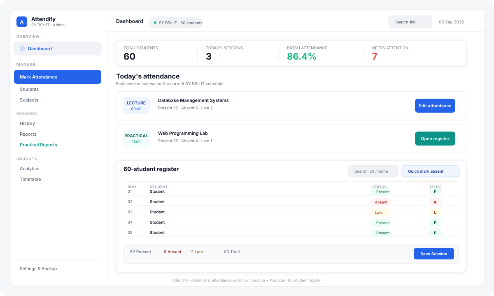

# Attendify

### SY BSc IT · Admin Attendance Management System

Attendify is a focused, offline-first web application for faculty and academic administrators to **record, manage, review, analyze, and report attendance** for a single **SY BSc IT batch of 60 students**.

The product is designed around one principle:

> **Make attendance administration fast, accurate, and effortless.**

Attendify is intentionally built as an **admin-first academic tool**, not a student self-attendance tracker.

---

## Overview

Attendify digitizes the everyday attendance workflow for a classroom-sized academic batch while keeping the interface lightweight and practical.

### Core workflow

```text
Dashboard
   ↓
Today's Session
   ↓
Lecture / Practical Attendance
   ↓
Quick Mark or 60-Student Register
   ↓
Review & Verify
   ↓
Save Session
   ↓
History · Analytics · Reports · Student Records
```

A new session can start with all students marked **Present**, or attendance can be entered quickly using roll-number based bulk marking. Individual records remain available for verification and correction.

### Product UI at a glance

The overview below is a **simplified representation of the actual Attendify interface**: the compact admin sidebar, taskbar, batch metrics, lecture/practical session surfaces, and dense 60-student register all mirror the product's current information architecture.

<p align="center">
  
</p>

---

## Key Features

### Attendance Management

- Admin-first attendance workflow for a 60-student batch
- Separate **Lecture Attendance** and **Practical Attendance** experiences
- Shared session-based attendance engine
- Quick Mark by absent or present roll numbers
- Mark All Present / Mark All Absent / Reset
- Individual Present / Absent / Late controls
- Unmarked-state validation
- Exceptions-only filtering
- Search by student name or roll number
- Undo recent attendance changes
- Copy attendance from a previous session
- Sticky live attendance summary
- Duplicate-session protection

### Student Management

- Complete batch student directory
- Roll number and name search
- Student attendance overview
- Overall and subject-wise attendance
- Attendance status classification
- Recent attendance history
- Defaulter / shortage identification

### Academic Management

- Subject and course management
- Faculty / room metadata where configured
- Lecture and practical classification
- Timetable management
- Today's schedule integration
- Direct attendance launch from scheduled sessions

### Practical Attendance & Reports

- First-class practical attendance workflow
- Practical / experiment title support
- Experiment-session reports
- Subject-wise practical reports
- Student-wise practical reports
- Complete batch practical summaries
- Date-range filtering
- Print-ready academic document layout
- CSV export

### Attendance History

- Session-based audit history
- Date and subject filtering
- Lecture / practical identification
- Present / Absent / Late summaries
- Session review and editing
- Derived statistics automatically recalculated after edits

### Analytics

- Overall batch attendance
- Subject comparison
- Lecture vs. practical attendance
- Attendance trends
- Attendance-threshold analysis
- Defaulter monitoring
- Repeated / consecutive absence insights
- Real-data visualizations with honest empty states

### Reports & Data Management

- Full batch attendance reports
- Defaulters reports
- Subject summaries
- Custom date-range reporting
- Attendance CSV export
- JSON backup and restore
- Session archival
- Safe application reset with confirmation

---

## Design & UX

Attendify follows a **modern academic administration** design language inspired by the principles of Apple and Linear:

- Clear information hierarchy
- Calm neutral surfaces
- Refined blue/indigo primary actions
- Semantic attendance states
- Compact, data-dense tables
- Purposeful cards and controls
- Minimal shadows and restrained borders
- Consistent spacing and typography
- Responsive layouts for desktop, tablet, and mobile
- Accessible focus and interaction states
- Reduced-motion support
- No decorative UI that competes with operational information

### UX principle

> **Less decoration. More clarity.**
>
> **Less clicking. More doing.**

---

## Technology Stack

Attendify is intentionally lightweight and uses browser-native technologies rather than a framework-heavy stack.

### Frontend

| Technology | Role |
|---|---|
| [](#) | Semantic application structure and accessible markup |
| [](#) | Design system, responsive layouts, themes, print styles, and component styling |
| [](#) | Application logic, state, interactions, reporting, and business rules |
| [](#) | Lightweight UI iconography and data visualizations |

### Persistence & Data

| Technology | Role |
|---|---|
| [](#) | Local browser persistence without a required server database |
| [](#) | Backup and restore format |
| [](#) | Attendance and report export format |

### Engineering & Delivery

| Technology | Role |
|---|---|
| [](#) | Source control and version history |
| [](#) | Repository hosting and project delivery |
| [](#) | Desktop, tablet, and mobile layouts |

### Application Architecture

The application uses a modular, dependency-light structure:

```text
index.html
│
├── UI / Shell
│   ├── app.js
│   └── ui.js
│
├── State & Persistence
│   ├── state.js
│   ├── storage.js
│   └── validation.js
│
├── Domain Logic
│   ├── attendance.js
│   └── utils.js
│
├── Feature Modules
│   ├── dashboard.js
│   ├── mark-attendance.js
│   ├── students.js
│   ├── subjects.js
│   ├── history.js
│   ├── analytics.js
│   ├── reports.js
│   ├── practical-reports.js
│   ├── timetable.js
│   └── settings.js
│
└── Styles
    ├── main.css
    ├── components.css
    ├── dashboard.css
    └── responsive.css
```

### Development Characteristics

- **No frontend framework** — intentionally framework-free
- **No runtime backend dependency** — current version is client-side and offline-first
- **No unnecessary third-party UI library** — components are implemented within the project design system
- **Browser print support** for academic documents and reports
- **Responsive CSS** for desktop, tablet, and mobile layouts

---

## Data Model

Attendance is modeled around actual academic sessions rather than personal attendance totals.

```text
Students
   │
   ├── Student
   └── Student

Subjects
   │
   └── Subject

Attendance Session
   │
   ├── Lecture
   └── Practical / Experiment
          │
          └── Attendance Records
                 ├── Student → Present
                 ├── Student → Absent
                 └── Student → Late
```

The **attendance records are the source of truth**. Batch and student percentages are derived from saved session records rather than manually edited totals.

---

## Project Structure

```text
Attendify/
├── assets/              # Static assets and product illustrations
├── css/                 # Global, component, dashboard, responsive styles
├── docs/                # Project documentation
├── js/                  # Application, domain, state and feature modules
├── tests/               # Automated tests
├── index.html           # Application entry point
└── README.md            # Project documentation
```

---

## Running Locally

Attendify is a static web application and can be served with any local HTTP server.

### Simple option

Open the project with a local development server such as the **VS Code Live Server extension**.

### Alternative

```bash
python -m http.server 8000
```

Then open:

```text
http://localhost:8000
```

Using a local HTTP server is recommended instead of opening `index.html` directly so browser storage and module behavior remain consistent.

---

## Data & Privacy

Attendify currently stores application data locally in the browser using LocalStorage. No server-side database is required for the current version.

Use the built-in **Backup / Restore** capability before clearing browser data, changing devices, or performing a major reset.

---

## Current Scope

The current product is intentionally focused on:

- **SY BSc IT**
- **Single Batch**
- **60 Students**
- Faculty / administrative attendance management
- Lecture and practical attendance
- Academic reporting and analysis

The internal architecture is modular so the product can be expanded later without turning the current experience into an unnecessarily complex university ERP.

---

## Engineering Principles

Attendify follows these principles:

1. **Accuracy over decoration** — attendance data and calculations must remain trustworthy.
2. **Workflow over feature count** — every feature should reduce administrative effort.
3. **Real data only** — reports and analytics never fabricate academic data.
4. **Progressive enhancement** — preserve browser-native, lightweight functionality where practical.
5. **Modularity** — storage, state, domain logic, features, and presentation remain separated.
6. **Accessibility by default** — keyboard, contrast, focus, semantics, and reduced motion are considered throughout the UI.
7. **Safe data handling** — imports, rendering, backups, and destructive actions are validated and guarded.

---

## Status

**Active development** — the core admin attendance workflow, lecture/practical attendance model, reporting, analytics, student management, timetable integration, and responsive UI are implemented and continue to be refined.

---

## License

Add the project's chosen license here when one is formally established.
