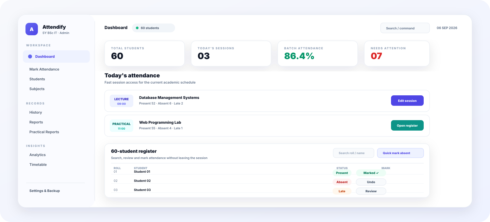

# 📊 ATTENDIFY

### **SY BSc IT · Admin Attendance Management System**

A focused, offline-first academic administration web app for **recording, reviewing, analyzing, and reporting attendance for a 60-student SY BSc IT batch** — built to make everyday classroom administration faster, clearer, and harder to get wrong.

  <a href="https://sy-it.netlify.app/"><strong>✦ Open Live App</strong></a>
  &nbsp; · &nbsp;
  <a href="https://github.com/chillingbing648-sketch/Attendify"><strong>⌘ View Source</strong></a>

---

## 🧰 Built With

  
  
  
  
  

  
  
  
  

  
  
  
  

---

  

  Dashboard → Session → Register → Review → Save → History / Analytics / Reports

---

## `>_` The Product

Attendify is an **admin-first attendance workspace** for a classroom-sized academic batch.

It is not a student self-attendance portal. The workflow is centered around the person actually taking attendance:

~~~text
See today's schedule
        ↓
Open a lecture / practical session
        ↓
Mark 60 students quickly
        ↓
Review exceptions
        ↓
Save the session
        ↓
Use the saved record for history, analytics and reports
~~~

The core design decision is simple:

> **Attendance records are the source of truth.**

Totals and percentages are derived from saved session data instead of being manually edited.

---

## ⚡ What It Covers

| Area | Capability |
|---|---|
| 📝 **Attendance** | Lecture and practical attendance with Present / Absent / Late states |
| ⚡ **Quick Mark** | Roll-number based bulk marking for rapid classroom entry |
| 👥 **Student Register** | Searchable 60-student roster with individual attendance views |
| 📚 **Subjects** | Course / subject management and attendance classification |
| 🗓️ **Timetable** | Today's sessions and direct attendance launch from scheduled classes |
| 🧪 **Practical Mode** | Experiment-aware attendance and dedicated practical reporting |
| 🕘 **History** | Session-level review, filtering and editing |
| 📈 **Analytics** | Batch, subject, trend, threshold and absence insights |
| 📊 **Reports** | Full-batch, subject, defaulter and custom date-range reporting |
| 📤 **CSV Export** | Academic attendance data export |
| 💾 **Backup / Restore** | JSON application backup and validated restore workflow |
| 🗄️ **Archival** | Preserve older attendance ledgers without permanently deleting them |
| ↩️ **Undo** | Reverse recent attendance changes during an active session |
| 🔁 **Copy Previous Session** | Start from an earlier session's attendance state |
| 🛡️ **Validation** | Guard against unmarked students and duplicate sessions |
| 🖨️ **Print Ready** | Clean academic report layouts for printing |
| 🌙 **Theme Support** | Browser-local theme preference support |
| 📱 **Responsive UI** | Desktop, tablet and mobile layouts |
| ♿ **Accessibility** | Focus states, semantic controls and reduced-motion handling |

---

## 🧭 The Attendance Journey

~~~text
┌──────────────┐
│  DASHBOARD   │
└──────┬───────┘
       │
       ▼
┌──────────────────────┐
│ TODAY'S SCHEDULE     │
│ Lecture / Practical  │
└──────────┬───────────┘
           │
           ▼
┌──────────────────────┐
│ MARK ATTENDANCE      │
│ Quick Mark / Register│
└──────────┬───────────┘
           │
           ▼
┌──────────────────────┐
│ REVIEW & VALIDATE    │
│ Present / Absent /   │
│ Late / Exceptions    │
└──────────┬───────────┘
           │
           ▼
┌──────────────────────┐
│ SAVE SESSION         │
└──────────┬───────────┘
           │
     ┌─────┼──────────────┐
     ▼     ▼              ▼
  HISTORY ANALYTICS     REPORTS
~~~

This keeps the primary task short while making every saved session reusable as an academic record.

---

## 🧩 Product Architecture

Attendify is deliberately **framework-free**.

The browser is the runtime, the modules are the application layers, and local storage provides persistence.

~~~text
                    ATTENDIFY
                        │
                 index.html shell
                        │
        ┌───────────────┼────────────────┐
        │               │                │
        ▼               ▼                ▼
       UI            State/Data       Domain Logic
    ui.js          state.js          attendance.js
    dashboard.js   storage.js        validation.js
                        │
        ┌───────────────┼────────────────────────┐
        │               │                        │
        ▼               ▼                        ▼
    Attendance        Academic                 Insights
 mark-attendance      students                 analytics
                     subjects                    history
                     timetable                   reports
                     practical-reports           settings
                        │
                        ▼
                 Browser Storage
                        │
              ┌─────────┴─────────┐
              ▼                   ▼
           JSON backup         CSV export
~~~

### Why no framework?

The project does not need a large framework runtime for its current scope.

Keeping the application in modular browser-native JavaScript gives the project:

- a small runtime surface
- direct control over the DOM
- straightforward deployment
- no build dependency requirement
- easy offline-first behavior
- a codebase that exposes its data and business rules clearly

---

## 🧠 Data Model

Attendance is modeled around **academic sessions**, not manually edited percentages.

~~~text
Batch
│
├── Students
│    └── 01 → 60
│
├── Subjects
│
├── Timetable
│
└── Attendance Sessions
      │
      ├── Lecture
      │    └── Student Records
      │
      └── Practical
           └── Experiment Records

Student Record
    ├── Present
    ├── Absent
    └── Late
~~~

Derived statistics are calculated from the saved session records.

This allows changes to a session to propagate back through:

~~~text
Session edit
   ↓
Attendance records
   ↓
Student statistics
   ↓
Subject statistics
   ↓
Batch analytics
   ↓
Reports
~~~

---

## ⚙️ Core Modules

| Module | Responsibility |
|---|---|
| `js/app.js` | Application shell, routing between views and startup orchestration |
| `js/ui.js` | Shared UI helpers, icons, dialogs and interaction utilities |
| `js/state.js` | Central application state and session data access |
| `js/storage.js` | Local persistence and browser data operations |
| `js/attendance.js` | Attendance calculations, session logic and derived statistics |
| `js/validation.js` | Input and data integrity checks |
| `js/dashboard.js` | Dashboard metrics and today's session surface |
| `js/mark-attendance.js` | Lecture/practical marking workflows |
| `js/students.js` | Student directory and student-level views |
| `js/subjects.js` | Subject / academic configuration |
| `js/history.js` | Session history and review |
| `js/analytics.js` | Attendance trends and analytical views |
| `js/reports.js` | Academic reports and CSV generation |
| `js/practical-reports.js` | Practical / experiment reporting |
| `js/timetable.js` | Schedule management and today's timetable |
| `js/settings.js` | Settings, backup, restore and archival |
| `css/main.css` | Global tokens and base styles |
| `css/components.css` | Reusable component styles |
| `css/dashboard.css` | Dashboard-specific presentation |
| `css/responsive.css` | Responsive behavior across breakpoints |

---

## 🎨 Design System

Attendify is intentionally **data-dense without becoming visually noisy**.

~~~text
Neutral surfaces
      +
Blue / indigo primary actions
      +
Semantic attendance states
      +
Compact tables
      +
Strong hierarchy
      +
Quiet borders
      +
Purposeful spacing
      +
Responsive interaction
      =
ATTENDIFY
~~~

### UX principles

> **Less decoration. More clarity.**

> **Less clicking. More doing.**

> **Show the exception, not the noise.**

> **Never fake an academic number.**

---

## ♿ Accessibility & Interaction

The interface includes several accessibility-oriented behaviors:

- visible keyboard focus states
- semantic HTML controls
- responsive touch targets
- reduced-motion handling
- print-specific presentation
- clear attendance status semantics
- guarded destructive actions
- usable layouts across desktop, tablet and mobile

The project remains suitable for further accessibility auditing and refinement.

---

## 💾 Local-First Data

Attendify currently works without a server-side database.

~~~text
User interaction
      ↓
Application state
      ↓
Browser LocalStorage
      ↓
Session / student / settings persistence
~~~

### Backup model

~~~text
Current application state
        │
        ├── JSON → Download Backup
        │
        └── Restore → Validate → Apply
~~~

This makes the project easy to run in a classroom or administrative environment without requiring account setup or hosted infrastructure.

**Operational note:** browser storage is device-local. Create a backup before clearing browser data, switching devices, or resetting the application.

---

## 🧪 Practical Attendance

Practical attendance is treated as a first-class workflow instead of a renamed lecture screen.

The product supports:

- practical session classification
- experiment / practical title context
- practical-specific reporting
- subject-wise practical summaries
- student-wise practical views
- complete practical ledgers
- report-ready layouts

That separation keeps lecture and laboratory attendance meaningful in the same academic model.

---

## 📊 Reporting & Analytics

Attendify turns saved attendance sessions into multiple views without maintaining separate manual totals.

### Reporting surface

~~~text
Today's Attendance
This Month
Full Batch Ledger
Defaulters
Subject Summary
Practical Report
Custom Date Range
~~~

### Analytics surface

- batch attendance
- subject comparisons
- lecture vs practical patterns
- attendance trends
- threshold monitoring
- shortage / defaulter visibility
- repeated and consecutive absence insights
- honest empty states when data is unavailable

The reporting layer is designed around real stored records rather than fabricated demo numbers.

---

## 🛡️ Data Integrity Guardrails

The application includes controls designed to reduce common administrative mistakes:

~~~text
Unmarked student
      ↓
Validation gate

Duplicate session
      ↓
Duplicate protection

Accidental change
      ↓
Undo / review

Older records
      ↓
Safe archival

Major reset
      ↓
Confirmation

Backup restore
      ↓
Validation → apply
~~~

These guardrails are as important to the product as the attendance buttons themselves.

---

## 📁 Project Structure

~~~text
Attendify/
│
├── assets/
│   ├── attendify-product-preview.svg
│   └── attendify-ui-overview.svg
│
├── css/
│   ├── main.css
│   ├── components.css
│   ├── dashboard.css
│   └── responsive.css
│
├── docs/
│
├── js/
│   ├── app.js
│   ├── ui.js
│   ├── state.js
│   ├── storage.js
│   ├── validation.js
│   ├── attendance.js
│   ├── dashboard.js
│   ├── mark-attendance.js
│   ├── students.js
│   ├── subjects.js
│   ├── history.js
│   ├── analytics.js
│   ├── reports.js
│   ├── practical-reports.js
│   ├── timetable.js
│   └── settings.js
│
├── tests/
├── index.html
└── README.md
~~~

---

## 🚀 Run Locally

Attendify is a static browser application.

### Recommended

Use **VS Code Live Server** or another local HTTP server.

### Python server

~~~bash
python -m http.server 8000
~~~

Then open:

~~~text
http://localhost:8000
~~~

Opening `index.html` through a local server is preferred over using `file://` directly because browser storage and module behavior are more consistent.

---

## 🌐 Live App

---

## 🎯 Current Scope

~~~text
Academic context
→ SY BSc IT

Roster
→ 60 students

Users
→ Faculty / academic administrators

Attendance
→ Lecture + Practical

Output
→ History + Analytics + Reports + Exports

Storage
→ Browser-local

Server
→ Not required
~~~

The architecture is intentionally modular so the project can grow into larger academic workflows without turning the current batch tool into an unnecessarily heavy university ERP.

---

## 📈 Engineering Status

| Area | Status |
|---|:---:|
| Admin attendance workflow | 🟢 |
| Lecture attendance | 🟢 |
| Practical attendance | 🟢 |
| Student management | 🟢 |
| Subject management | 🟢 |
| Timetable | 🟢 |
| Session history | 🟢 |
| Analytics | 🟢 |
| Reports | 🟢 |
| CSV export | 🟢 |
| JSON backup / restore | 🟢 |
| Archival | 🟢 |
| Responsive UI | 🟢 |
| Reduced-motion handling | 🟢 |
| Automated test coverage | 🟡 |
| Expanded accessibility audit | 🟡 |
| Multi-batch / multi-institution support | 🔲 |
| Cloud synchronization | 🔲 |

**Project stage:** Active academic administration tool

---

## 🗺️ Roadmap

### Near term

- Broaden automated testing around attendance calculations
- Expand accessibility validation
- Continue refining mobile workflows
- Improve report customization

### Later

- Multi-batch support
- Multi-course / multi-institution configuration
- Optional cloud synchronization
- Role-based administration
- Stronger import / migration tooling

The roadmap describes future direction; the implemented repository remains the source of truth for current behavior.

---

## 🔒 Privacy & Data Boundaries

The current application does not require a hosted backend or account system.

~~~text
No server database
No required login
No cloud document storage
Browser-local application data
User-controlled backup / restore
~~~

Because attendance records are stored locally, responsibility for backup and device security remains with the person operating the application.

---

## 🤝 Contributing

Useful contributions should improve:

~~~text
Accuracy
   +
Accessibility
   +
Reliability
   +
Academic workflow
   +
Maintainability
~~~

Before submitting a change, verify the core flow:

~~~text
Mark → Validate → Save → Review → Report
~~~

---

## 📜 License

The repository does not currently declare an open-source license.

Without a license, the source code should not be assumed to be freely reusable or redistributable.

---

### **Attendance, without the administrative friction.**

**ATTENDIFY**

HTML5 · CSS3 · JavaScript · SVG · Web Storage · JSON · CSV · GitHub

  

<a href="https://sy-it.netlify.app/"><strong>Open the App ↗</strong></a>
&nbsp;&nbsp; · &nbsp;&nbsp;
<a href="https://github.com/chillingbing648-sketch/Attendify"><strong>Explore the Repository ↗</strong></a>

